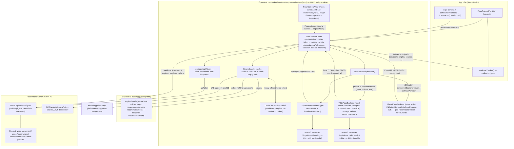

# PoseTracker React Native SDK — Architecture (v1)

SDK React Native "coquille mince" au-dessus d'un moteur distribué à distance,
inspiré de l'architecture du SDK Sency (`@sency/react-native-smkit`, voir
`sency-teardown/findings/SENCY_TEARDOWN.md`), adapté à la stack PoseTracker
existante (MoveNet TF.js + backend Strapi + configs de mouvements serveur).

> **Adaptive camera quality / crash-loop guard** (profils Prime→Basic,
> AdaptiveChoice, auto-downgrade FPS, alertes développeur) : voir
> [`ADAPTIVE_QUALITY.md`](./ADAPTIVE_QUALITY.md).
>
> **Événements temps réel** (init / keypoints / warning / error — parité
> WebView PoseTracker `sendDataToNative`) : voir [`EVENTS.md`](./EVENTS.md).

## 1. Vue d'ensemble



Principe central (hérité de Sency, durci ici) : **le SDK npm ne contient
AUCUNE logique métier d'exercice**. En revanche le **runtime de pose
estimation est embarqué** (TF.js + MoveNet + pipeline wasm + page WebView)
pour un cold start immédiat sans téléchargement :

- **`pose-runtime` (bundlé npm)** : injecté dans la WebView via
  `getBundledRuntimeParts()` — aucun download au `preload()`, keypoints-only
  offline dès le premier lancement. Régénéré par
  `npm run build:runtime-payload` → `bundledRuntimeAssets.js`.
- **`movement-engine` (remote, clé API)** : bundle JS de reconnaissance
  d'exercices (`EngineLoader`, cache FS scellé). Liste `exercises` filtrée
  par plan (`sdk_premium`). L'endpoint Strapi `GET /api/sdk/pose-runtime`
  peut encore exister côté backend mais **n'est plus requis** par le SDK RN.

Toute la logique métier (steps, seuils, scoring, recommandations) vit dans
le **bundle engine** post-handshake. Sans clé API → **keypoints-only** (§3).

## 2. Contrat du handshake

### Requête

`POST {baseUrl}/api/sdk/configure` (implémenté dans
`PoseTrackerStrAPI/src/api/sdk/`, route `auth: false`, validation manuelle du
token comme `GET /users/authorizedMe`) :

```json
{
  "apiToken": "<optionnel — token PoseTracker = users-permissions.user.api_uuid>",
  "sdkName": "posetracker-rn",
  "sdkVersion": "0.1.0",
  "targetPlatform": "ios | android",
  "poseModelProfile": "AdaptiveChoice | UltraLite | Lite | Pro | Prime",
  "locale": "en",
  "localVersions": { "poseRuntime": "2026-08-06-5c6dfa58", "engine": "0.1.0" }
}
```

Statuts : `401` token invalide/révoqué (body `{ revoked: true }` → le SDK
purge ses caches scellés) · `429` quota du plan dépassé · `200` manifeste.
**Sans `apiToken`** : `200` avec le **manifest public** (descripteur
`poseRuntime` uniquement — `sessionToken`, `plan`, `engine` à `null`,
`exercises` vide). `localVersions` permet au backend de répondre `upToDate`
par module (pas de re-download inutile).

**Le handshake n'incrémente pas les compteurs d'usage** (décision explicite :
c'est un appel de configuration). Le metering se fait au **lancement réel** :
`POST /api/sdk/track` (`camera_start`) quand la WebView signale caméra +
modèle prêts — avec clé : mêmes compteurs que `authorizedMe` (check quota) +
ligne `sdk-usage-event` avec les params ; sans clé : ligne anonyme (file de
retry locale si offline). Voir §8.

### Réponse (`SdkManifest`, types dans `src/types/manifest.ts`)

```json
{
  "sessionToken": "<JWT users-permissions, sdk:true, 24 h>",
  "plan": { "plan": "developer", "remainingCalls": 4988, "commercialUse": true },
  "resolvedProfile": "Lite",
  "models": {
    "UltraLite": { "modelId": "movenet-singlepose-lightning", "format": "tfjs-graph-model",
                    "inputSize": 192, "signedUrl": null, "sha256": null, "version": "4" },
    "Lite": "…", "Pro": "…", "Prime": "…"
  },
  "engine": {
    "version": "0.1.0",
    "signedUrl": "{baseUrl}/api/sdk/engine?st=<sessionToken>",
    "sha256": "82247bc7…",
    "minSdkVersion": "0.1.0"
  },
  "exercises": [
    {
      "id": "squat", "name": "squat", "type": "dynamic",
      "movement": { "…": "définition Strapi complète : movement_steps[] { position, percentage, scale_acceptance, movement_parameters[], movement_recommendations[] }, movement_initial_posture" }
    }
  ],
  "referenceMovements": [],
  "expiresAt": 1754400000000
}
```

- `models.signedUrl: null` = « utilise la copie bundlée dans le SDK » (v1 :
  toujours le cas). Le champ existe pour distribuer plus tard des modèles
  par profil sans casser les vieux SDK.
- `exercises[].movement` = la **même structure Strapi** que celle consommée
  par le front WebView (`authorizedMe`) : éditer un mouvement dans le
  dashboard met à jour le comportement du SDK au prochain handshake. Les
  configs d'exercices n'existent **que** derrière un handshake validé (live
  ou cache de session chiffré) — rien n'est bundlé dans le package npm.
- `referenceMovements` : spec prête (uuid + URL signée de signature + sha256),
  vide en v1 (la comparaison de référence n'est pas portée dans le moteur v1).

## 3. Modes d'exécution & frontière commerciale

Le SDK expose deux modes, publiés dans l'état du provider/hook
(`mode: 'keypoints-only' | 'full-engine'`, en plus du `status`) :

- **`keypoints-only`** — la valeur socle du SDK, disponible **sans réseau et
  sans clé API** : chargement stabilisé du MoveNet bundlé, warm-up, pipeline
  caméra cross-platform, stream des événements `keypoints` bruts
  (x, y, score). **Aucune reconnaissance de mouvements** : pas de `counter`,
  `angles`, `posture`, `progression`, `recommendations`, `form_score` ni
  `exercise_summary` ; `exercises` est vide et `startExercise()` lève une
  erreur explicite.
- **`full-engine`** — tous les événements. Requiert un **handshake
  authentifié** : live, ou rejoué depuis le cache de session chiffré écrit
  lors d'un handshake réussi antérieur (pattern Sency : cold start offline
  OK *si on a déjà été configuré*).

### Frontière commerciale : pourquoi il n'y a plus de moteur fallback bundlé

La v1 initiale bundlait un moteur fallback minimal + un exercice par défaut
dans le package npm. **Supprimé** (et non simplement gaté) : un gating à
l'exécution ne protège pas un package npm — le JS du fallback (angles
métier, machine à reps, seuils squat) restait extractible par simple lecture
de `node_modules` et réutilisable sans clé. La règle est donc structurelle :

> **Aucun octet de logique métier dans le package npm.** L'intelligence
> n'existe que (1) côté serveur, (2) dans le bundle engine servi contre un
> JWT de session, (3) dans le cache local **scellé** post-handshake.

Le rôle « offline pur dès le premier lancement » de l'ex-fallback est repris
par le mode keypoints-only ; le rôle « cold start offline d'un client déjà
configuré » est repris par le cache de session :

- Manifeste (configs d'exercices) **et** bundle engine sont mis en cache
  scellés par un keystream SHA-256 dérivé du token API
  (`src/cache/obfuscate.ts`). Sans le token qui les a obtenus, le cache est
  illisible (et purgé s'il ne s'ouvre pas) ; changer de token invalide le
  cache de l'ancien. C'est de l'**obfuscation** assumée, pas du DRM : un
  client muni d'un token valide lit évidemment le JS téléchargé — l'objectif
  est qu'aucun chemin ne délivre la logique métier *sans* token validé.
- Token révoqué (`invalid_token` au handshake) ⇒ **purge du cache de
  session** : la révocation coupe l'engine au prochain lancement connecté.

### Matrice des modes (pose bundlé + engine remote)

Le pose-runtime est **toujours** disponible (npm). Pas de
`network_required` pour la pose.

| Internet | Clé API | Cache session antérieur | Résultat | Notes |
|---|---|---|---|---|
| ✅ | ✅ valide | indifférent | `full-engine` | handshake + engine + track `camera_start` online |
| ✅ | ❌ aucune | — | `keypoints-only` | MoveNet bundlé ; `camera_start` anonyme |
| ❌ | ❌ aucune | — | `keypoints-only` | offline dès le 1er lancement |
| ❌ | ✅ | ✅ | `keypoints-only` + **`offline_metered`** | session métrée refusée (`startExercise()` lève) |
| ✅ | ❌ invalide/révoquée | ✅ ou ❌ | `keypoints-only` | caches engine **purgés** |
| ✅ | ✅ quota dépassé | ✅ ou ❌ | `keypoints-only` | `error` code `quota_exceeded` |

Règles transverses :

- **`ready` est atteint sans réseau** (seul `error` fatal : échec load modèle
  local). Handshake raté → événement `error` non bloquant + keypoints-only.
- **Session métrée = track online obligatoire** avec clé API (`offline_metered`
  sinon).
- **Upgrade à chaud** keypoints-only → full-engine, **sans redémarrer le
  pipeline caméra** : `configure(apiToken)` (exposé par le hook) peut être
  appelé à tout moment — y compris pendant que la caméra streame. Le backend
  d'inférence n'est pas touché ; à la réussite, `mode` passe à
  `full-engine`, `exercises` se remplit et les événements métier commencent
  à émettre dès `startExercise()`. Échec ⇒ on reste en keypoints-only,
  réessayable (retour du réseau, nouveau token).
- Le passage inverse n'existe pas en cours de session : un engine chargé
  reste chargé jusqu'au `dispose()`.

## 4. Cycle de vie & warm-up

> Guide intégrateur détaillé : **[PRELOAD.md](./PRELOAD.md)**
> (Provider ≠ preload, `autoPreload`, warmer WebView, ordre des étapes).

**Important :** monter `<PoseTrackerProvider>` crée le client mais **ne
lance pas** le chargement IA. Il faut `preload()` / `warmup()` (ou
`autoPreload` sur le provider). Pour le backend WebView, `warmup()` attend
qu’une `WebViewPoseView` poste `ready` — d’où le warmer invisible sur
l’écran pré-caméra (voir testapp `DiagnosticsScreen`).

`PoseTrackerClient.preload()` (exposé via `usePoseTracker().preload/warmup`),
idempotent, à appeler dès l'écran précédant la caméra :

| Statut | Travail effectué |
|---|---|
| `configuring` | handshake optionnel (engine) ; échec réseau → cache session scellé ou keypoints-only |
| `downloading` | bundle **engine** seulement (clé API) : cache scellé → download → sinon keypoints-only |
| `warming` | attend le `ready` WebView (runtime **bundlé** injecté, bench zéros, profil capture) |
| `ready` | modèle / page prêts ; le metering `camera_start` n’est **pas** ici (démarrage caméra) |
| `error` | échec du modèle local — jamais pour un handshake raté seul (voir §3) |

## 5. Offline, cache, intégrité (mécanismes Sency imités)

| Mécanisme Sency (teardown) | Implémentation PoseTracker |
|---|---|
| Handshake `POST /user/sm/configure` → manifeste + URLs signées | `POST /api/sdk/configure` → `SdkManifest` (+ `GET /api/sdk/engine` token-gated) |
| Modèles bundlés cold-start (`useBundledModelsOnColdStart`) | MoveNet Lightning tfjs **dans le package npm** (`assets/`), chargé via `bundleResourceIO` sans réseau |
| `preloadModelsInBackground()` | `preload()` / `warmup()` + `autoPreload` sur le provider |
| Validation magic `TFL3` des fichiers cachés | SHA-256 du bundle engine re-validé **à chaque chargement** contre le manifeste (après descellement) ; fichier corrompu ou scellé par un autre token purgé |
| `TfliteRuntimeGuard` PROBING→PASSED/FAILED (crash-loop guard) | `EngineLoader` : flag `probing` en AsyncStorage avant `new Function(bundle)` ; si l'app est morte pendant l'éval précédente → bundle marqué `failed`, dégradation en keypoints-only |
| Ladder de dégradation 256→192→160→128→ML Kit | v1 : dégradation **full-engine → keypoints-only** ; ladder de profils prévu dans les types (§7) |
| SDK RN = coquille mince sur moteur natif | SDK npm = coquille ; logique métier dans le bundle engine distant, jamais dans le npm |

Chaîne de résolution :
`manifeste live` → `manifeste caché scellé (même token)` → *keypoints-only* ;
puis `engine cache scellé (sha ok)` → `download (sha ok)` → *keypoints-only*.
Un premier lancement **sans aucun réseau** atteint quand même `ready`
(keypoints-only sans handshake antérieur, full-engine avec — voir la matrice
du §3). Ces comportements sont couverts par les smoke tests de l'EngineLoader
(`engine/scripts/smoke-test.mjs`, section 3).

## 6. Décisions clés

### Backends d'inférence : TF.js (socle universel) + TFLite natif (implémenté)

Trois backends coexistent derrière `PoseBackend`. MoveNet (tfjs/tflite)
émet **17 keypoints COCO** ; Apple Vision émet **19** (COCO + `neck` +
`root`). Détail et matrice Expo Go / perf :
[NATIVE_POSE_BACKENDS.md](./NATIVE_POSE_BACKENDS.md).

| | TF.js | TFLite natif | Apple Vision (iOS) |
|---|---|---|---|
| Disponibilité | **Expo Go** OK | dev build (deps optionnelles + Nitro) | dev build iOS (pod `PoseTrackerVision`, pas de Nitro) |
| Modèle | MoveNet Lightning tfjs (~4,6 Mo) | MoveNet Lightning f16 .tflite (~4,8 Mo) | Framework système (aucun bundle) |
| Accélération | rn-webgl/expo-gl | CoreML→Metal→XNNPACK / GPU→XNNPACK | Neural Engine / GPU Vision |
| Perfs | A15 ~17–36 ms ; Mali-G52 ~220–280 ms | A15 ~3–8 ms ; Android mid ~5–30 ms | A15 ~5–15 ms |
| Caméra | TensorCamera → `processFrame` | `PoseCameraView` resize + `runSync` | `PoseCameraView` + plugin `detectBodyPose` |
| Joints | 17 COCO | 17 COCO | 19 (COCO + neck + root) |

**Sélection** (`preferredBackend: 'auto' | 'tfjs' | 'tflite' | 'vision'`,
plus `iosPoseProvider` sur iOS) : en `'auto'`, TFLite si chargeable sinon
TF.js ; Vision uniquement si `iosPoseProvider: 'apple-vision'` ou
`preferredBackend: 'vision'`. Chaîne de fallback auto : Vision → TFLite →
TF.js. Expo Go : `isExpoGo()` court-circuite tout require Nitro / Vision.

### Caméra : chemins selon le backend

- **TF.js** : `cameraWithTensors` / TensorCamera → `processFrame(tensor)` —
  seul chemin Expo Go.
- **TFLite** : `PoseCameraView` — resize plugin + `runSync` worklet +
  `ingestPose()`.
- **Apple Vision** : même `PoseCameraView` — frame processor plugin natif
  `detectBodyPose` (`VNDetectHumanBodyPoseRequest` sur le CVPixelBuffer).

### Format du bundle engine

- **JS CommonJS unique, minifié** (esbuild, `platform: neutral`, ES2019),
  contrat : `module.exports.createEngine(): PoseTrackerEngine`.
- Évalué via `new Function(code)` — supporté par Hermes et JSC. Conforme à la
  guideline Apple 3.3.2 (code interprété par le runtime JS embarqué, ne
  change pas la nature de l'app) ; à mentionner lors de la review si besoin.
- Source : `posetracker-rn-sdk/engine/` — **copie adaptée** (jamais un
  déplacement) de `PoseTrackerFront/lib/MovementHandler.js`,
  `lib/SportsHandler/common.js` (`computeAngles`), `lib/body_keypoints.js`.
  Les keypoints normalisés [0,1] sont projetés sur un repère virtuel 640×480
  pour conserver l'échelle des seuils « pixels » des configs Strapi.
- Build : `npm run build` → `dist/engine.bundle.js` + `dist/engine.meta.json`
  (`{version, sha256, bytes}`), à copier dans
  `PoseTrackerStrAPI/private/sdk-engine/` (voir le README de ce dossier).
- Protection : le bundle n'est **pas** dans le package npm ; il n'est servi
  que contre un JWT de session issu d'un handshake avec token valide. (Un
  client authentifié peut évidemment lire le JS téléchargé — l'objectif est
  le contrôle de distribution + la mise à jour à chaud, pas un DRM.)

### Événements : mapping avec l'API WebView

Mêmes types d'événements, payloads **typés et normalisés** (le transport
postMessage/JSON n'existe plus, on gagne des types propres) :

| WebView (postMessage) | SDK (callbacks typés) |
|---|---|
| `keypoints` `{ data: [{name,x,y,score}] }` | `onKeypoints` `{ keypoints, score, timestampMs }` |
| `angles` `{ data: {left_side, right_side} }` | `onAngles` `{ angles: AngleValue[] }` (id `left_knee`, `right_hip`, …) |
| `counter` `{ current_count, form_score? }` | `onCounter` `{ count }` + `onFormScore` `{ score, average, grade }` séparé |
| `posture` `{ message, ready }` | `onPosture` `{ ready, hint, missingKeypoints }` |
| `progression` `{ value }` | `onProgression` `{ value }` |
| `recommendations` `{ data: string[] }` | `onRecommendations` `{ recommendations }` |
| `exercise_summary` | `onExerciseSummary` `{ counter, averageFormScore, grade, history, durationMs }` |
| `initialization` / `error` | `onInitialization` / `onError` (codes stables) |

## 7. Profils adaptatifs (préparé, non implémenté)

Les types (`PoseModelProfile`, `ModelsByProfile`, `resolvedProfile`) et le
manifeste transportent déjà `UltraLite/Lite/Pro/Prime/AdaptiveChoice`. v1 :
tout profil ⇒ MoveNet Lightning bundlé, `resolvedProfile: "Lite"`.

Chemin d'évolution (calqué sur l'algorithme AdaptiveChoice de Sency, §4.2 du
teardown) :
1. Côté SDK : score de capacité device (RAM, cœurs, année, ABI) → profil
   demandé dans `ConfigureRequest`, mis en cache par device.
2. Côté Strapi : `models` par profil avec `signedUrl`/`sha256` réels
   (Lightning en Lite/UltraLite, **Thunder** en Pro/Prime, modèles custom
   TFLite ensuite) ; caps par plan.
3. Côté backend d'inférence : `TflitePoseBackend` accepte déjà un
   `ModelDescriptor` au format `'tflite'` + `localModelPath` (fichier
   téléchargé/validé) — il ne manque que la distribution par profil côté
   manifeste (Thunder f16 récupérable dès maintenant via
   `node scripts/fetch-tflite-model.mjs --thunder`). Le cache EngineLoader-
   style (sha256 + guard) fera alors office de ladder 256→192→….

## 8. Limites connues (v1)

- **Comparaison aux mouvements de référence** non portée dans le moteur
  (spec présente dans le manifeste ; le front a un `referenceComparisonEngine`
  quasi-pur, candidat direct pour le bundle v2).
- `form_score` du moteur distant = progression validée du step (approximation) ;
  le scoring 4 axes (shape/precision/timing/stability) viendra avec le
  portage du moteur de référence.
- ~~**Metering** : le handshake ne compte pas d'usage~~ — **implémenté**
  (2026-08-06) : `POST /api/sdk/track` au `camera_start` (unité = session
  caméra, comme un call WebView) ; incrément des compteurs + ligne
  `sdk-usage-event` (source `sdk`/`webview`, params du call, anonyme ou
  rattachée). Les points d'incrément WebView existants (`authorizedMe`,
  signature de référence, script) insèrent la même ligne (non bloquant).
- `GET /api/sdk/engine` servi par Strapi (pas d'URL S3 présignée — aucune
  génération d'URL signée n'existait dans le code) ; migration S3 prévue.
- Le moteur v1 porte la machine à états **legacy** (`MovementHandler`) ; le
  front a aussi un moteur V3 (`lib/v3/exerciseEngine.js`, configs locales) à
  porter dans une itération suivante.
- Inférence temps réel non mesurée sur device physique (pas de device ici) ;
  le pipeline complet jusqu'à `estimatePose(tensor)`/`processFrame(tensor)`
  est livré et l'intégration caméra documentée dans `example/`.
- L'app d'exemple est livrée comme source de référence (non buildée ici).

## 9. Arborescence

```
posetracker-rn-sdk/
├── packages/react-native-posetracker/   # le package SDK (npm)
│   ├── assets/movenet-singlepose-lightning/         # modèle tfjs bundlé (model.json + 2 shards)
│   ├── assets/movenet-singlepose-lightning-tflite/  # modèle .tflite f16 bundlé
│   ├── src/
│   │   ├── api/configure.ts             # client handshake
│   │   ├── backends/PoseBackend.ts      # abstraction d'inférence
│   │   ├── backends/tfjs/               # implémentation TF.js MoveNet (+ durcissement GL)
│   │   ├── backends/tflite/             # implémentation TFLite native (delegates, canary, decode worklet)
│   │   ├── camera/PoseCameraView.tsx    # chemin caméra vision-camera (worklet zero-copy)
│   │   ├── cache/obfuscate.ts           # scellement du cache de session (clé dérivée du token)
│   │   ├── engine/EngineLoader.ts       # download + cache scellé + sha256 + crash-loop guard
│   │   ├── client.ts                    # orchestrateur (statuts, mode, sessions, processFrame, sélection backend)
│   │   ├── PoseTrackerProvider.tsx      # provider + usePoseTracker (mode, configure à chaud)
│   │   └── types/                       # events, manifest, pose, acceleration
│   └── scripts/{fetch-model,fetch-tflite-model}.mjs
├── engine/                              # source du bundle distant (non publié npm)
│   ├── src/{angles,movement,index}.ts   # ports de computeAngles + MovementHandler
│   └── scripts/{build,smoke-test}.mjs   # smoke tests : engine + frontière commerciale du loader
├── example/                             # app Expo : keypoints-only sans clé → upgrade à chaud
└── docs/ARCHITECTURE.md
```
